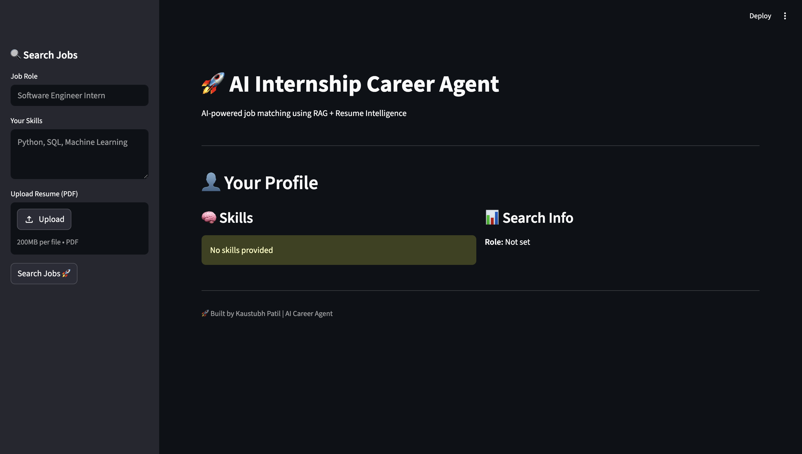
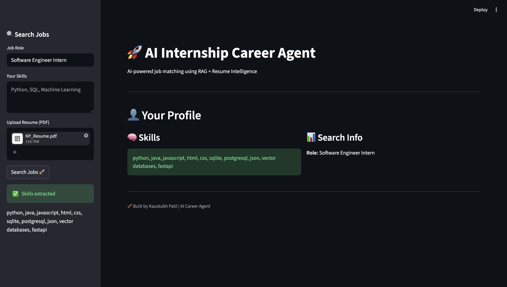
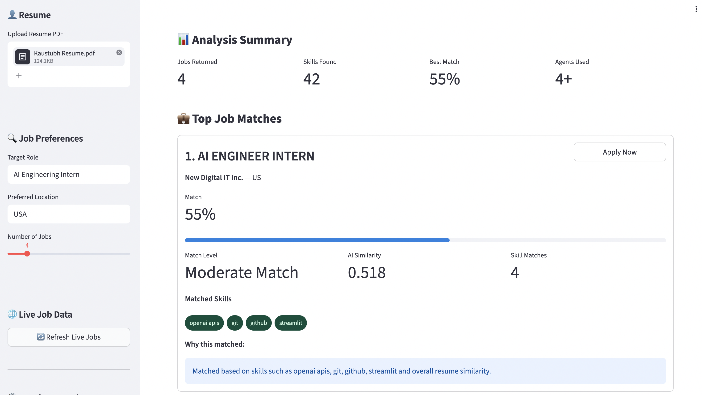
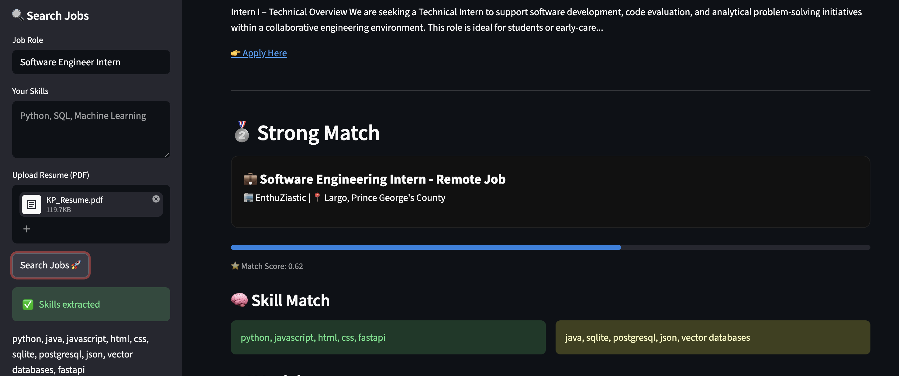
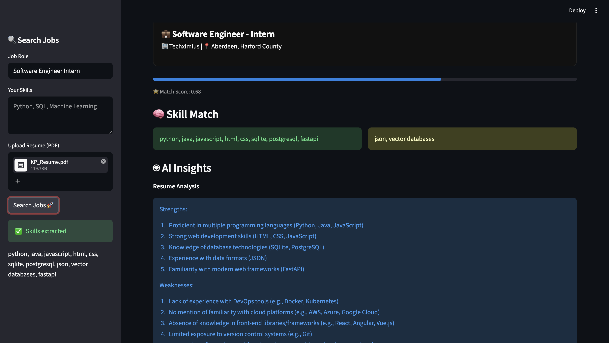
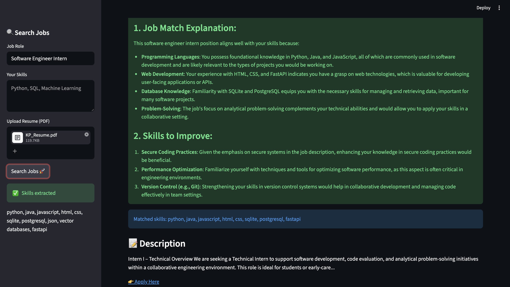
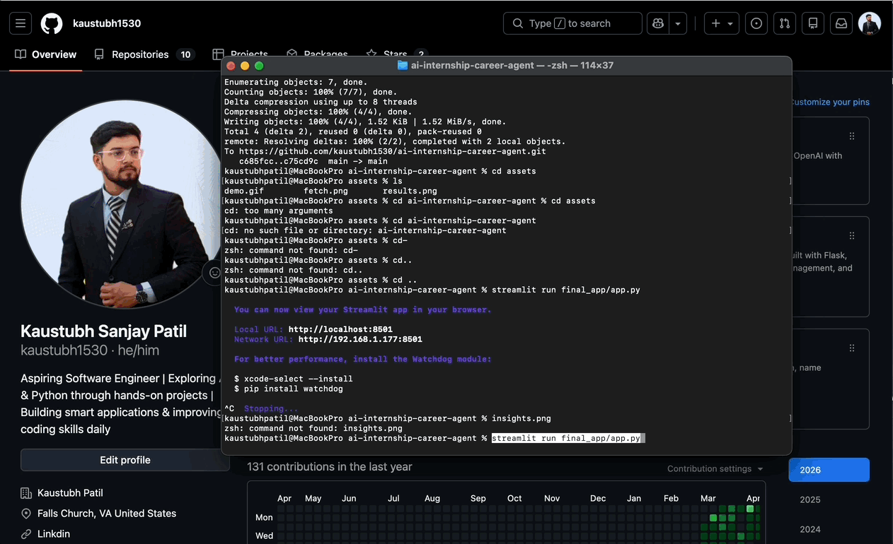

# AI Internship Career Agent

An AI-powered career assistant that analyzes resumes, matches jobs using semantic search (RAG), and provides personalized career advice using a multi-agent system.

---

## Features

- Real-time job search
- Resume parsing (PDF → skills extraction)
- Multi-agent AI system:
  - Resume Agent (analyzes strengths)
  - Job Matching (RAG + embeddings)
  - Career Advisor Agent (gives improvement suggestions)
- Hybrid ranking (semantic search + skill matching)
- Personalized job recommendations
- Clean Streamlit UI dashboard

---

## How It Works

1. User enters job role or uploads resume  
2. Resume is parsed → skills extracted using OpenAI  
3. Jobs are fetched and stored in FAISS (vector DB)  
4. RAG retrieves most relevant jobs  
5. AI agents analyze:
   - Resume strengths
   - Job requirements
   - Skill gaps  
6. System outputs:
   - Ranked job matches  
   - Skill comparison  
   - Career advice  

---

## Tech Stack

- Python  
- Streamlit  
- OpenAI API  
- FAISS (Vector Search)  
- RAG (Retrieval-Augmented Generation)  
- Prompt Engineering  
- Multi-Agent Systems  

---

## Screenshots

### Profile Section


### Resume Upload


### Job Matches



### AI Insights


### Career Advice

---

## Demo




---

## Setup

```bash
git clone https://github.com/YOUR_USERNAME/ai-internship-career-agent.git
cd ai-internship-career-agent

pip install -r requirements.txt

streamlit run final_app/app.py

Author
KAUSTUBH PATIL