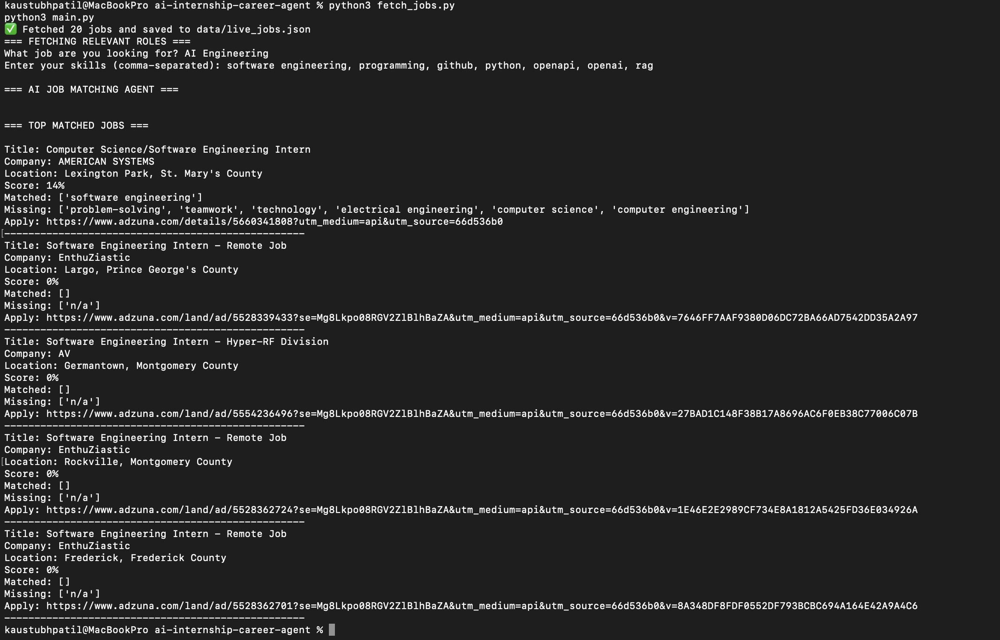
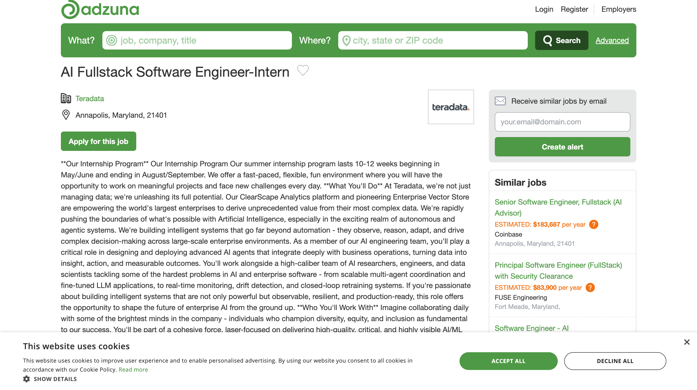

# AI Internship Career Agent

## Overview
AI-powered job matching system using real job APIs and OpenAI skill extraction.

## Features
- Live job fetching (Adzuna API)
- AI skill extraction using OpenAI
- Job ranking system
- Skill gap analysis
- Real application links

## Tech Stack
- Python
- OpenAI API
- Adzuna API

## How It Works
1. Fetch real jobs
2. Extract skills using AI
3. Match with user skills
4. Rank jobs by score

## Run Project
python3 fetch_jobs.py  
python3 main.py  

## Example Input
Skills: python, git, fastapi

## Output
- Ranked jobs
- Match scores
- Missing skills
- Apply links

## Architecture
Adzuna API → Python → OpenAI → Matching Engine → Ranked Output

## 📸 Demo Proof

## Why This Matters
Real AI system for internship/job matching using live data and LLMs.